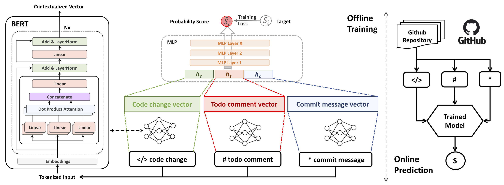

# *TDClearner*

_**TDCleaner**_ (_**T**O**D**O Comment **Cleaner**_) is a tool for automatically detecting obsolete **TODO** comments in software repos. 

Our full research paper: [_**Automating the Removal of Obsolete TODO Comments**_](http://arxiv.org/abs/2108.05846) has been published on The ACM Joint European Software Engineering Conference and Symposium on the Foundations of Software Engineering (*ESEC/FSE*), 2021. For more details please refer to our research paper:  
http://arxiv.org/abs/2108.05846

Please cite our work if you found our work is helpful:

```
@article{gao2021automating,
  title={Automating the Removal of Obsolete TODO Comments},
  author={Gao, Zhipeng and Xia, Xin and Lo, David and Grundy, John and Zimmermann, Thomas},
  journal={arXiv preprint arXiv:2108.05846},
  year={2021}
}
```

**TDCleaner** Workflow
<p align="center">
  
</p>

### 01. Train and Evaluation
The core_code folder contains the source code and preprocessed data to replicate our experiment, the important files are as follows:

- **data_tokenize.py**: Tokenize with BERT Tokenizer
- **data_loader.py**: DataLoader module
- **train_3d.py**: training script with *code\_change, TODO\_comment, commit\_message*. 
- **eval.py**: evaluation script   
- **Bert_MLP.py**: The model used for TDCleaner
- **utils.py**: inluding necessary libaray
- **data**: this folder includes the processed data for train/val/test 


To train our model with processed data set, please run with the following scripts:  

```
STEP1: python 2_data_tokenize.py
STEP2: python 3_data_loader.py
STEP3: python 4_train_3d.py
``` 
To evluate our model, please use the following scripts:

```
STEP4: 5_eval.py
``` 

### 02. About the Dataset 
We provide both the raw dataset and processed dataset, _**the raw dataset is to facilitate other researchers to extend our work and implement their own ideas**, **the processed dataset is to help others to replicate our approach.**_

1. **The raw TODO comments data set**:   
We collect TODO comments from TOP-10,000 Python and Java Github repositories. 
This dataset contains more than 416K TODO comments for Python and more than 351K TODO comments for Java. 
For this raw data set, each TODO comment is associated with a specific commit\_id.

2. **The processed TODO comments data set**:  
After data processing and labelling, we extract the positive and negative samples from the raw TODO comments dataset, which are used for our experiment. 


